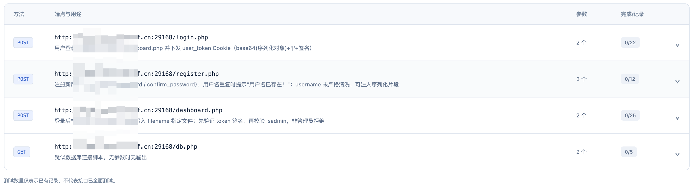
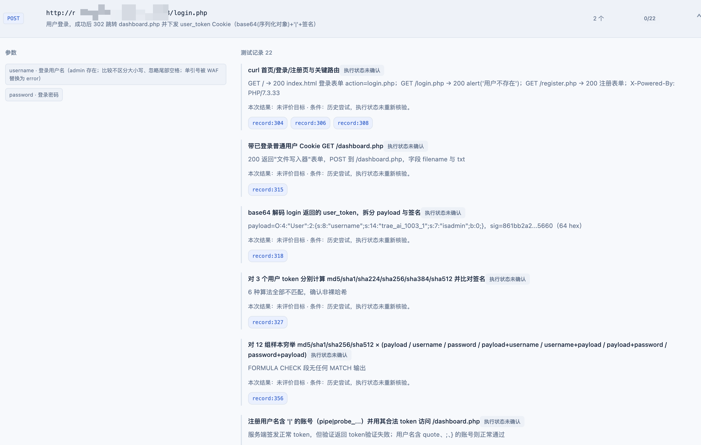
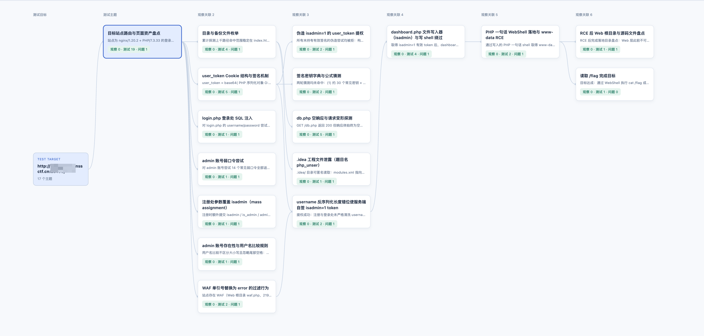

# FlySecAgent Plugin

**面向所有agent的插件式 API 台账与测试记录服务：汇集已发现的接口，记录测试动作、结果与证据。**

Agent 在测试过程中会读到前端 JS、接口响应和脚本输出，但发现的 API 可能散落在不同工具记录里：哪些接口已经发现、参数是什么、后续测试过什么、结果在哪里，往往不容易回查。

FlySecAgent 面向各类 **Agent / CLI / IDE / 自建 Agent** 提供插件式执行记忆接入方案，不绑定某一个 Agent 产品或模型。它通过插件、Hook 或适配器收集工具事件，由 **Memory Curator（记忆整理器）** 整理成可追溯的 API 台账与测试历史，不替换主 Agent 的工具链。本文以 **Codex** 为接入示例；具体宿主的适配要求与完成情况见下方接入章节。

> 本项目不替主 Agent 执行目标测试，也不独立扫描全部 API。它整理的是主 Agent 实际读到、执行过并被 Hook 收到的材料。

## 核心能力：从 API 发现到测试记录

| 阶段       | 记录什么                  | 可以回答的问题                    |
| -------- | --------------------- | -------------------------- |
| 首次发现 API | 端点、用途、参数及来源证据         | Agent 发现了哪些接口？这个接口大致做什么？   |
| 后续尝试     | 测试动作、实际返回、执行状态与条件     | Agent 对哪个 API 做了什么测试？返回如何？ |
| 持续更新     | 复用 API 身份、追加新记录、保留旧历史 | 有没有重复记录？前后两轮发生了什么变化？       |
| 证据回查     | 原始工具输入、输出及 record 引用  | 这个描述来自哪次调用？能否查看原文？         |

例如，主 Agent 读到一段 JS，其中包含 `/api/orders?status=...`：

1. 整理器从已读取的材料中提取接口、用途和 `status` 参数；用途不明确时保留不确定性。
2. 后续对该接口的尝试关联到同一 API，记录动作和结果，而不是再次创建一个重复接口。
3. 若脚本在发送请求前报错，记录执行问题，不把它写成“该 API 没有漏洞”。
4. 后来实际请求返回 HTTP 200，再追加一条记录；保留之前的报错，也不据此宣称全面测试完成。

**“已发现”“已有尝试”“缺少测试记录”是不同状态；一条成功请求不代表接口已经全面覆盖。** API 的语义提取由模型辅助，仍可能漏提取或解释不准确。

## 界面预览

以下为已遮挡目标地址的界面示例，不是对当前目标执行的新测试。

### 1. API 台账：接口概览与测试追踪

集中展示已发现接口的请求方法、端点、用途、参数数量及测试记录统计。支持按端点、用途或参数搜索，并可展开接口查看参数详情、测试历史与关联证据。



“完成/记录”分别表示执行状态标为已执行的尝试数量，以及已有测试记录数量。截图含未重新核验执行状态的历史记录，因此可能显示 `0/22`；这不表示没有记录、没有尝试或全部失败。

### 2. 测试历史：看 Agent 对这个 API 做过什么

展开接口后，查看参数、测试动作、返回结果、条件和 `record` 证据。新增尝试追加到历史中，已有记录不会被下一轮总结覆盖。



### 3. 探索图：辅助回看测试过程

探索图展示主题、观察与测试的关联，支持页面全屏与缩放。它是台账的辅助视图，不是把某个方向永久标为安全或已穷尽的证明。



## 其他能力

- **会话隔离**：项目绑定宿主提供的真实 session ID，记录与记忆按会话归属。
- **证据留存**：保存 Hook 收到的原始工具输入和输出，支持长内容分段回查与离线补交。
- **周期整理**：主回合活跃期间每五分钟整理；Stop、SessionEnd 及受支持的 Interrupt 事件触发收尾。
- **历史与报告**：查看记忆发布版本、观察修正及 Markdown 报告。
- **项目列表**：搜索筛选项目，查看采集、整理和发布状态。
- **记忆反馈**：通过宿主支持的 additionalContext 交付新版本摘要，帮助下一轮参考已有尝试与未确认事项，不自动接续主 Agent 回合。

## 工作方式

```text
主 Agent 读取 JS / 调用接口 / 运行工具
                  ↓
           Hook 保存原始记录
                  ↓
       Memory Curator 整理已有材料
                  ↓
       Python 校验、合并并发布记忆
                  ├──→ Web：API 台账 / 测试历史 / 原始证据
                  ↓
         生成简短 map / 任务记忆摘要
                  ↓
       反馈 Hook / 宿主适配器读取新版本
                  ↓
       通过 additionalContext 等上下文接口交付
                  ↓
         主 Agent 下一次受支持请求参考
                  ↓
         继续任务，产生新的工具执行记录
```

这里的 map 是简短任务记忆摘要，不是整张探索图。**生成摘要与交付摘要是两个步骤**：整理器提交记忆后，由反馈 Hook / 宿主适配器负责把新版本交付给主 Agent。

以 Codex 为例，反馈应通过其受支持 Hook 的 `additionalContext` 进入后续模型请求的额外上下文，**不需要另起一个 Codex Agent 做转发或重新总结**。项目现有交付逻辑读取 `/hook/map.pending`，输出摘要后通过 `/hook/map.ack` 签收；同版本不反复交付。

这不是原位替换系统提示词，也不会自动唤醒已经结束的主 Agent。签收仅表示 Hook 已输出，不证明模型采纳。上述 Codex 交付仍需完成其专用适配与端到端验证，当前状态见下方接入章节。

Memory Curator 只使用两个模型工具：

| 工具               | 用途                   |
| ---------------- | -------------------- |
| `curator_read`   | 读取当前会话的记忆、分页记录和完整证据  |
| `curator_commit` | 提交结构化增量，接受结果以服务端回执为准 |

## 环境要求

- Python **3.11+**。
- Node.js **22.19.0+**，满足当前 Pi SDK 的运行要求。
- npm。
- 当前 Hook 实现使用 POSIX 文件锁，主要面向 macOS / Linux；Windows 接入尚未验证。
- Memory Curator 使用的模型 API 与有效凭据。

后端使用 Python / FastAPI / SQLite，Pi 桥使用 TypeScript，工作台使用原生 HTML / CSS / JavaScript。无需 Docker。

## 快速开始

以下命令均在项目根目录运行。

### 1. 安装与构建

```bash
python3 -m venv .venv
source .venv/bin/activate
python3 -m pip install -e '.[dev]'

npm ci --prefix pi_ext
python3 -m service.export_schemas
npm run build --prefix pi_ext
```

Python 模型是工具 Schema 的唯一来源；协议字段修改后，需要重新生成 Schema 并构建 Pi 桥。

### 2. 配置整理模型

推荐把 API Key 存在私有文件中：创建 `data/.deepseek-key`，内容为实际密钥，然后设置权限。

```bash
mkdir -p data
chmod 700 data
chmod 600 data/.deepseek-key
export FLYSEC_PI_API_KEY_FILE="$PWD/data/.deepseek-key"
```

请先创建密钥文件再运行 `chmod`。不要把真实密钥写入源码、README、Hook 配置或 Git。

| 环境变量                     | 用途 / 当前默认值                                     |
| ------------------------ | ---------------------------------------------- |
| `FLYSEC_PI_PROVIDER`     | 模型提供方标识，默认 `deepseek`                          |
| `FLYSEC_PI_MODEL`        | 模型 ID，默认 `deepseek-flash`                      |
| `FLYSEC_PI_BASE_URL`     | 模型接口地址，默认 `https://api.deepseek.com/anthropic` |
| `FLYSEC_PI_API_KEY_FILE` | API Key 文件；未指定时读取当前数据目录的 `.deepseek-key`       |
| `FLYSEC_PI_API_KEY`      | 可选的环境变量密钥，设置后优先于文件                             |

模型 ID 必须是提供方实际支持的值。当前桥根据接口地址选择 Anthropic Messages 或 OpenAI Chat Completions 兼容方式；不要把任意协议的服务地址直接当作已验证兼容。

### 3. 启动服务

```bash
python3 -m service
```

打开 [本地工作台](http://127.0.0.1:8787/web/)，或检查健康状态：

```bash
curl http://127.0.0.1:8787/health
```

服务默认绑定 `127.0.0.1:8787`。网页只读，Hook、Control 和 Memory 接口使用令牌鉴权。

可通过 `FLYSEC_PORT` 修改端口，通过 `FLYSEC_DATA_DIR` 修改数据目录。修改后，Hook 配置的服务地址和数据目录也必须对应更新。

## 插件式集成

FlySecAgent 的接入层与记忆服务分开：为不同 Agent 实现事件适配器，后端、API 台账和 Web 工作台可以复用，不需要把主 Agent 替换成项目内置的执行器。

```text
不同 Agent / CLI / IDE / 自建 Agent
                ↓ 插件、Hook 或包装适配器
          统一的会话与工具事件
                ↓
           FlySecAgent 服务
                ↓
         API 台账与测试过程记忆
```

原则上，只要宿主能提供或通过包装层暴露以下能力，就可以开发适配接入：

| 宿主能力        | 用途                          |
| ----------- | --------------------------- |
| 稳定的会话标识     | 将项目、API 和执行记录归属到正确会话        |
| 工具调用输入及结果   | 记录 Agent 发现了什么、测试了什么以及返回如何  |
| 回合开始与结束事件   | 控制周期整理和结束收尾                 |
| 上下文扩展入口（可选） | 将记忆摘要交付后续请求；没有该入口时仍可通过工作台查看 |

**项目架构面向不同 Agent，本文仅以 Codex 演示接入思路。** 后端、API 台账与整理流程可以复用，但各宿主的事件、权限和上下文反馈需要分别适配；通用架构不等于所有 Agent 已经即插即用。

## 接入示例：Codex

### 当前状态

本仓库已有会话、回合、工具结果和结束事件的处理脚本，以及本机事件回归与整理服务验收。**Codex 插件打包、自动安装配置和真实 Codex 会话端到端联调尚待完成**；后端测试通过不代表 Codex 接入已经完成。

目前不要把仓库中的旧 YAML 草稿当作可直接安装的 Codex 配置，也没有可使用的 `hook.install_codex` 安装命令。

### 接入通道

Codex 官方提供生命周期 Hook，可使用项目级 `.codex/hooks.json` / `.codex/config.toml`，或随插件打包 Hook。配置和信任要求以 [Codex Hooks 官方文档](https://learn.chatgpt.com/docs/hooks) 与 [插件打包官方文档](https://developers.openai.com/plugins/build/plugins) 为准。

FlySecAgent 的 Codex 适配需要连接以下通道：

| 通道                                  | 目的                              | 仓库中的事件处理模块              |
| ----------------------------------- | ------------------------------- | ----------------------- |
| `SessionStart`                      | 读取真实会话标识、预热连接与补交队列；项目绑定还需由适配器对接 | `hook.on_session_start` |
| `UserPromptSubmit`                  | 已启用会话的回合开始与新记忆交付                | `hook.on_user_prompt`   |
| `PostToolUse`                       | 收集支持的工具输入和结果，关联 API 测试记录        | `hook.post_tool_use`    |
| `Stop` / `SessionEnd` / `Interrupt` | 结束活动回合并整理已有证据；各事件字段与时限需分别验证     | `hook.on_stop`          |

这些 Python 模块是接入组件，不是已经完成安装的 Codex 插件。适配器还需处理显式启用、项目创建、真实会话绑定、错误事件映射，以及不同工具返回格式。

### 使用流程

1. 按快速开始安装依赖、配置整理模型并启动本地服务。
2. 完成 Codex 项目 Hook 或插件配置，将受支持的事件映射到 FlySecAgent。
3. 在 Codex 中审查并信任实际 Hook 定义，不绕过信任检查。
4. 先用本机合成场景验证项目绑定、工具记录、回合收尾和记忆交付，再开启已授权的实际任务。
5. Codex 执行原有任务，Memory Curator 整理收到的材料；通过本地工作台回查接口与测试历史。

项目与会话绑定后，应能在台账中看到 Codex 已发现的 API、后续尝试、结果及证据。仅看到服务健康检查或配置文件，不作为采集成功证明。

## 工作台与反馈

- **项目列表**：按名称、目标、会话 ID 搜索，筛选状态并进入详情。
- **探索图**：查看主题、观察与测试的关联；支持页面全屏、缩放与 Esc 返回。
- **API 台账**：展开参数、动作、结果与证据；有测试记录不代表全面覆盖。
- **证据与反馈**：查看原始工具输入、返回、整理日志和任务记忆摘要。
- **历史与报告**：查看已发布版本及 Markdown 报告。

反馈只交付未签收的新版本。签收表示 Hook 已输出，不证明模型一定采纳。additionalContext 是补充上下文，不是原位替换系统提示词，也不是主 Agent 的自动执行指令。

## 本地验证

```bash
FLYSEC_PI_COMMAND='python3 -u -m service.pi_stub' python3 -m pytest -q
npm run typecheck --prefix pi_ext
node pi_ext/tests/memory-loop.mjs
```

回归使用显式 stub，验证协议、窗口、事务、生命周期和 Hook 行为，不作为真实模型解题证明。

真实模型的隔离验收：

```bash
python3 scripts/validate_memory_v2.py
```

脚本启动本机合成 HTTP fixture，使用已配置模型完成两轮整理，检查 API 发现、参数、身份复用、测试追加、错误分类、证据引用与版本交付。模型会产生实际 API 用量；不会请求现有靶场，结果写入私有 `data/v2-validation-*`。

本地验收不能保证所有模型解释都正确，也不等于新旧版本在所有 CTF 中的解题率、耗时或 token 成本已经完成比较。

## 项目结构

```text
hook/                         宿主 Agent 接入与事件采集
├── on_session_start.py       会话事件处理、连接预热与队列补交
├── on_user_prompt.py         已启用会话的回合开始与记忆交付
├── on_stop.py                回合结束与后台整理触发
├── post_tool_use.py          提交工具输入与执行结果，交付新记忆
└── common.py                 HTTP 通信、本地暂存队列、失败补交与摘要交付

service/                      本地后端，运行入口为 python3 -m service
├── app.py                    HTTP 应用、鉴权、路由与请求日志
├── routers/                  Hook、整理工具、控制接口及工作台接口
├── db.py / schema.sql        SQLite 连接与数据库表结构
├── scheduler.py              按会话管理整理任务的触发与调度
├── observation.py            处理窗口、记忆发布、书签推进及故障恢复
├── pi_runner.py              Pi 子进程生命周期与消息通信
├── schemas.py                数据结构与校验规则
├── view.py                   从记忆快照生成工作台展示数据
├── feedback.py               生成交付给主 Agent 的任务记忆摘要
└── report.py                 生成报告

pi_ext/                       Memory Curator 与 Pi 模型会话的桥接层
├── src/                      会话入口、整理循环、工具定义与服务端通信
└── resources/                整理提示词与工具 Schema

web/                          只读工作台：项目、探索图、API 台账与证据
├── index.html                页面结构
├── app.js                    数据加载、视图渲染与交互
└── styles.css                页面样式与响应式布局

tests/                        后端、Hook、调度、发布事务与记忆协议回归测试
scripts/
└── validate_memory_v2.py      使用本机合成 HTTP 场景和真实模型验证两轮记忆更新

data/                         私有运行数据：数据库、密钥、日志、队列及验收产物
                              不提交 Git
```

## 参考项目

- [ARTEX](https://github.com/Autumn-27/ARTEX)
- [Heimdall Agent](https://github.com/QiantangCredit/heimdall-agent)
